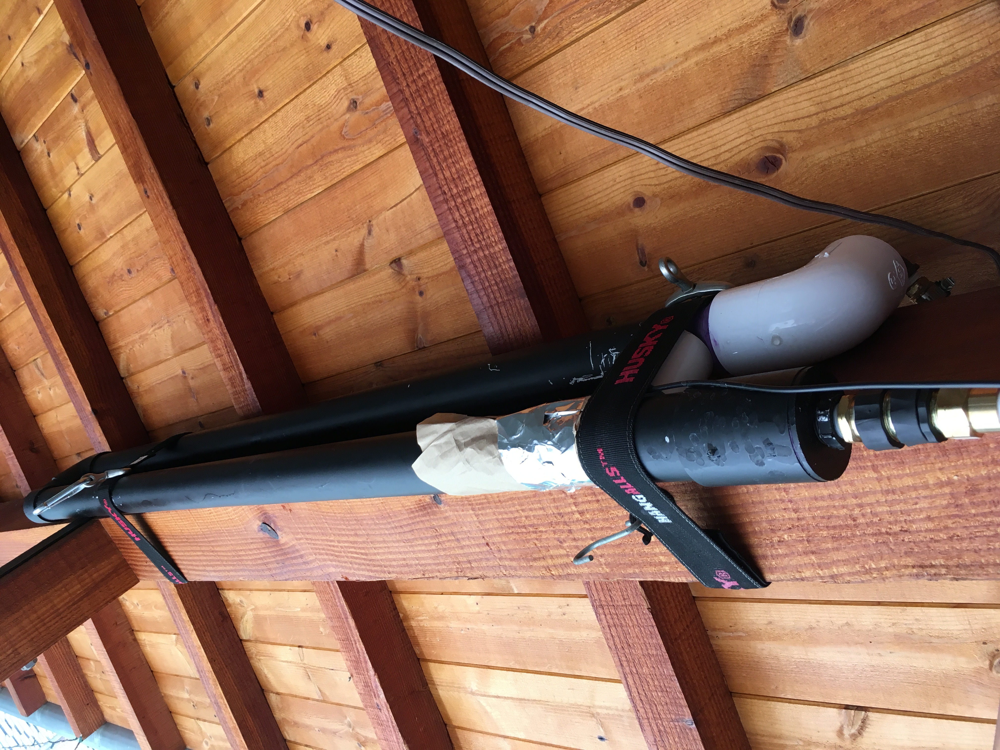
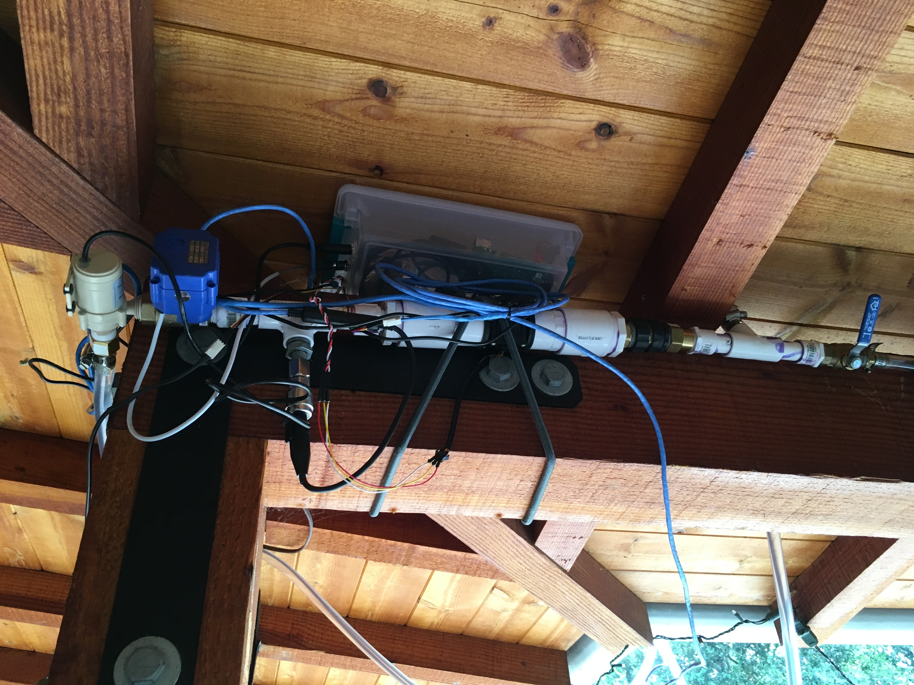
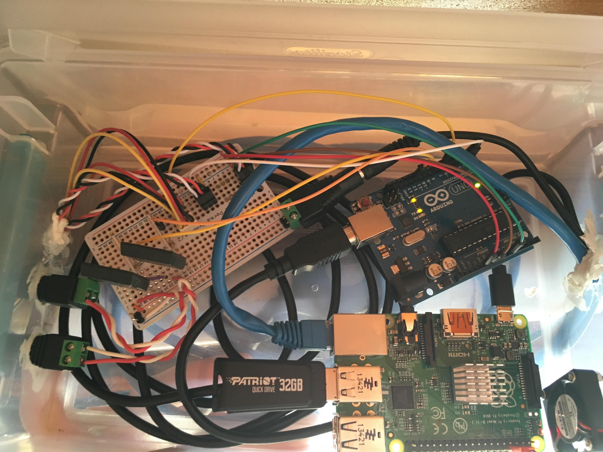
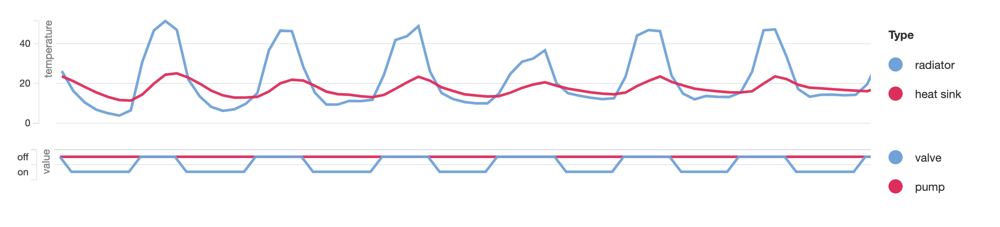
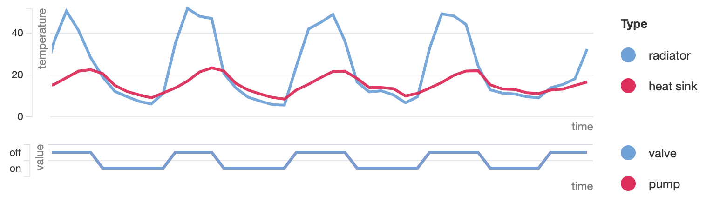

#### Introduction

As an experiment, to test passive cooling for a wine closet, I built a demo cooling unit. This uses a passive water heater, some PVC, a pump, an actuating valve, three temperature sensors, an Arduino Uno, and a Raspberry Pi, to cool water stored in the PVC during the night, monitor the system, and collect data.

#### Water System

This basically consisted of a solar water heater (which acts as a radiator), some large PVC pipe for water storage (heatsink) placed below the radiator.

The solar radiator would lose its heat to the night sky. The water in it would cool down and natural convection makes the water circulate through the system cooling the heatsink below.

The storage water was outside, so it would warm up quite a bit turning the day. The final version will include well insulated water storage.

#### Electronics

I used electronics to monitor and enhance the cooler. These should not be strictly necessary for this setup, but I wanted to collect data, and see what happened -- make a proof of concept.

I attached a number of sensors, a pump, and an actuating valve. Temperature sensors would detect that the radiator was colder than the water storage and open a valve (and optionally turn on a pump)

These were connected to a breadboard which was connected to an Arduino Uno. The Uno would monitor the sensors and actuate the pump and valve. It then sent data to the Raspberry Pi.

#### Data

I ran the collected data through a node server I built to make some basic graphs.

Without actuating the pump, we can see that when the radiator on the roof cooled down, the heatsink (mislabeled as heat sink :P) would also cool down.

When the pump was activated, the heatsink temperature stayed much closer on average compared to just allowing natural convection.

##### Other possible additions

A few experiments I could have done, and will probably do in the future: leave both valve and pump off for a few days and the valve on for a few days and see what happens. Leaving just the valve on for a few days should be basically the same, as no convection current should be created during the day.

#### Next Step

Next, I'm going to increase the size of the water storage (heatsink), insulate it as well as I can, and add a third part (the cooler) which will use the heatsink to keep itself at a steady 13° Celsius and absorb excess heat in a wine closet.

Copyright 2019 Collin Webb
